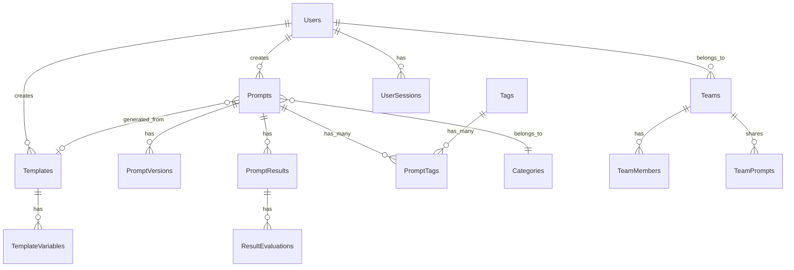

# 05. データ設計

## 🗄️ データベース設計概要

### ERD（Entity Relationship Diagram）


---

## 📋 テーブル定義詳細

### 1. ユーザー管理

#### 1.1 Users テーブル
```sql
CREATE TABLE users (
    id UUID PRIMARY KEY DEFAULT gen_random_uuid(),
    email VARCHAR(255) UNIQUE NOT NULL,
    username VARCHAR(50) UNIQUE,
    display_name VARCHAR(100),
    avatar_url TEXT,
    bio TEXT,
    
    -- 認証関連
    password_hash VARCHAR(255), -- null可（OAuth専用ユーザー）
    email_verified BOOLEAN DEFAULT false,
    two_factor_enabled BOOLEAN DEFAULT false,
    
    -- プロフィール
    preferred_language VARCHAR(10) DEFAULT 'ja',
    timezone VARCHAR(50) DEFAULT 'Asia/Tokyo',
    
    -- 設定
    notification_preferences JSONB DEFAULT '{
        "email_notifications": true,
        "push_notifications": true,
        "weekly_digest": true
    }',
    
    -- プラン・使用状況
    plan_type VARCHAR(20) DEFAULT 'free', -- free, pro, enterprise
    api_usage_limit INTEGER DEFAULT 100,
    api_usage_current INTEGER DEFAULT 0,
    api_usage_reset_date TIMESTAMP,
    
    -- タイムスタンプ
    created_at TIMESTAMP DEFAULT CURRENT_TIMESTAMP,
    updated_at TIMESTAMP DEFAULT CURRENT_TIMESTAMP,
    last_login_at TIMESTAMP,
    deleted_at TIMESTAMP, -- ソフトデリート
    
    -- インデックス
    INDEX idx_users_email (email),
    INDEX idx_users_username (username),
    INDEX idx_users_created_at (created_at)
);
```

#### 1.2 UserSessions テーブル
```sql
CREATE TABLE user_sessions (
    id UUID PRIMARY KEY DEFAULT gen_random_uuid(),
    user_id UUID NOT NULL REFERENCES users(id) ON DELETE CASCADE,
    session_token VARCHAR(255) UNIQUE NOT NULL,
    refresh_token VARCHAR(255),
    
    -- セッション情報
    ip_address INET,
    user_agent TEXT,
    device_info JSONB,
    
    -- 有効期限
    expires_at TIMESTAMP NOT NULL,
    created_at TIMESTAMP DEFAULT CURRENT_TIMESTAMP,
    last_used_at TIMESTAMP DEFAULT CURRENT_TIMESTAMP,
    
    INDEX idx_sessions_user_id (user_id),
    INDEX idx_sessions_token (session_token),
    INDEX idx_sessions_expires (expires_at)
);
```

### 2. プロンプト管理

#### 2.1 Categories テーブル
```sql
CREATE TABLE categories (
    id UUID PRIMARY KEY DEFAULT gen_random_uuid(),
    name VARCHAR(100) NOT NULL,
    slug VARCHAR(100) UNIQUE NOT NULL,
    description TEXT,
    icon VARCHAR(50), -- アイコン名
    color VARCHAR(7), -- HEXカラーコード
    
    -- 階層構造
    parent_id UUID REFERENCES categories(id),
    sort_order INTEGER DEFAULT 0,
    
    -- メタデータ
    is_system BOOLEAN DEFAULT false, -- システム定義カテゴリ
    is_active BOOLEAN DEFAULT true,
    
    created_at TIMESTAMP DEFAULT CURRENT_TIMESTAMP,
    updated_at TIMESTAMP DEFAULT CURRENT_TIMESTAMP,
    
    INDEX idx_categories_slug (slug),
    INDEX idx_categories_parent (parent_id)
);
```

#### 2.2 Tags テーブル
```sql
CREATE TABLE tags (
    id UUID PRIMARY KEY DEFAULT gen_random_uuid(),
    name VARCHAR(100) NOT NULL,
    slug VARCHAR(100) UNIQUE NOT NULL,
    description TEXT,
    
    -- タグタイプ
    type VARCHAR(50) DEFAULT 'general', -- general, usage, project, quality
    color VARCHAR(7),
    
    -- 統計
    usage_count INTEGER DEFAULT 0,
    
    -- システム管理
    is_system BOOLEAN DEFAULT false,
    is_suggested BOOLEAN DEFAULT false, -- AI提案タグ
    
    created_at TIMESTAMP DEFAULT CURRENT_TIMESTAMP,
    updated_at TIMESTAMP DEFAULT CURRENT_TIMESTAMP,
    
    INDEX idx_tags_name (name),
    INDEX idx_tags_type (type),
    INDEX idx_tags_usage (usage_count DESC)
);
```

#### 2.3 Prompts テーブル
```sql
CREATE TABLE prompts (
    id UUID PRIMARY KEY DEFAULT gen_random_uuid(),
    user_id UUID NOT NULL REFERENCES users(id) ON DELETE CASCADE,
    category_id UUID REFERENCES categories(id),
    template_id UUID REFERENCES templates(id), -- テンプレート由来の場合
    
    -- 基本情報
    title VARCHAR(200) NOT NULL,
    description TEXT,
    content TEXT NOT NULL, -- プロンプト本文
    
    -- AI設定
    target_ai_model VARCHAR(100), -- gpt-4, claude-3, etc.
    ai_parameters JSONB DEFAULT '{}', -- temperature, max_tokens等
    
    -- 分類・タグ
    visibility VARCHAR(20) DEFAULT 'private', -- private, team, public
    language VARCHAR(10) DEFAULT 'ja',
    
    -- 評価・統計
    rating_average DECIMAL(3,2) DEFAULT 0.0,
    rating_count INTEGER DEFAULT 0,
    usage_count INTEGER DEFAULT 0,
    success_rate DECIMAL(3,2), -- 成功率（評価ベース）
    
    -- 状態管理
    status VARCHAR(20) DEFAULT 'draft', -- draft, published, archived
    is_favorite BOOLEAN DEFAULT false,
    priority INTEGER DEFAULT 0, -- 0-5の重要度
    
    -- 共有・コラボレーション
    is_public BOOLEAN DEFAULT false,
    allow_comments BOOLEAN DEFAULT true,
    allow_derivatives BOOLEAN DEFAULT true, -- 派生作成許可
    
    -- バージョン管理
    version_number INTEGER DEFAULT 1,
    parent_prompt_id UUID REFERENCES prompts(id), -- 派生元
    
    -- タイムスタンプ
    created_at TIMESTAMP DEFAULT CURRENT_TIMESTAMP,
    updated_at TIMESTAMP DEFAULT CURRENT_TIMESTAMP,
    published_at TIMESTAMP,
    last_used_at TIMESTAMP,
    archived_at TIMESTAMP,
    
    -- 検索用
    search_vector tsvector GENERATED ALWAYS AS (
        to_tsvector('japanese', coalesce(title, '') || ' ' || coalesce(description, '') || ' ' || coalesce(content, ''))
    ) STORED,
    
    -- インデックス
    INDEX idx_prompts_user_id (user_id),
    INDEX idx_prompts_category (category_id),
    INDEX idx_prompts_visibility (visibility),
    INDEX idx_prompts_status (status),
    INDEX idx_prompts_rating (rating_average DESC),
    INDEX idx_prompts_usage (usage_count DESC),
    INDEX idx_prompts_created (created_at DESC),
    INDEX idx_prompts_search USING GIN (search_vector)
);
```

#### 2.4 PromptTags テーブル（多対多）
```sql
CREATE TABLE prompt_tags (
    prompt_id UUID NOT NULL REFERENCES prompts(id) ON DELETE CASCADE,
    tag_id UUID NOT NULL REFERENCES tags(id) ON DELETE CASCADE,
    
    -- タグ付けメタデータ
    added_by_user_id UUID REFERENCES users(id),
    is_ai_suggested BOOLEAN DEFAULT false,
    confidence_score DECIMAL(3,2), -- AI提案の場合の確信度
    
    created_at TIMESTAMP DEFAULT CURRENT_TIMESTAMP,
    
    PRIMARY KEY (prompt_id, tag_id),
    INDEX idx_prompt_tags_prompt (prompt_id),
    INDEX idx_prompt_tags_tag (tag_id)
);
```

### 3. バージョン管理

#### 3.1 PromptVersions テーブル
```sql
CREATE TABLE prompt_versions (
    id UUID PRIMARY KEY DEFAULT gen_random_uuid(),
    prompt_id UUID NOT NULL REFERENCES prompts(id) ON DELETE CASCADE,
    version_number INTEGER NOT NULL,
    
    -- バージョン内容
    title VARCHAR(200) NOT NULL,
    description TEXT,
    content TEXT NOT NULL,
    
    -- 変更情報
    change_summary TEXT, -- 変更内容のサマリー
    change_reason TEXT, -- 変更理由
    changed_by_user_id UUID REFERENCES users(id),
    
    -- AI設定のスナップショット
    target_ai_model VARCHAR(100),
    ai_parameters JSONB,
    
    -- パフォーマンスデータ
    performance_metrics JSONB DEFAULT '{}', -- 評価、成功率等
    
    created_at TIMESTAMP DEFAULT CURRENT_TIMESTAMP,
    
    -- 複合主キー（prompt_id + version_number）
    UNIQUE(prompt_id, version_number),
    INDEX idx_versions_prompt (prompt_id),
    INDEX idx_versions_created (created_at DESC)
);
```

### 4. AI結果・評価

#### 4.1 PromptResults テーブル
```sql
CREATE TABLE prompt_results (
    id UUID PRIMARY KEY DEFAULT gen_random_uuid(),
    prompt_id UUID NOT NULL REFERENCES prompts(id) ON DELETE CASCADE,
    prompt_version_id UUID REFERENCES prompt_versions(id),
    user_id UUID NOT NULL REFERENCES users(id) ON DELETE CASCADE,
    
    -- AI実行情報
    ai_model VARCHAR(100) NOT NULL,
    ai_parameters JSONB,
    
    -- 入力・出力
    input_text TEXT NOT NULL, -- 実際に送信されたプロンプト
    output_text TEXT, -- AIの回答
    output_metadata JSONB, -- 追加のメタデータ（画像URL等）
    
    -- 実行情報
    execution_time_ms INTEGER, -- 実行時間（ミリ秒）
    token_usage JSONB, -- トークン使用量
    cost_usd DECIMAL(10,6), -- コスト（USD）
    
    -- ステータス
    status VARCHAR(20) DEFAULT 'pending', -- pending, completed, failed
    error_message TEXT, -- エラーの場合
    
    created_at TIMESTAMP DEFAULT CURRENT_TIMESTAMP,
    completed_at TIMESTAMP,
    
    INDEX idx_results_prompt (prompt_id),
    INDEX idx_results_user (user_id),
    INDEX idx_results_created (created_at DESC),
    INDEX idx_results_status (status)
);
```

#### 4.2 ResultEvaluations テーブル
```sql
CREATE TABLE result_evaluations (
    id UUID PRIMARY KEY DEFAULT gen_random_uuid(),
    result_id UUID NOT NULL REFERENCES prompt_results(id) ON DELETE CASCADE,
    user_id UUID NOT NULL REFERENCES users(id) ON DELETE CASCADE,
    
    -- 評価スコア
    overall_rating INTEGER CHECK (overall_rating >= 1 AND overall_rating <= 5),
    
    -- 詳細評価
    accuracy_rating INTEGER CHECK (accuracy_rating >= 1 AND accuracy_rating <= 5),
    usefulness_rating INTEGER CHECK (usefulness_rating >= 1 AND usefulness_rating <= 5),
    creativity_rating INTEGER CHECK (creativity_rating >= 1 AND creativity_rating <= 5),
    readability_rating INTEGER CHECK (readability_rating >= 1 AND readability_rating <= 5),
    
    -- フリーフォーム評価
    comment TEXT,
    is_good BOOLEAN, -- 簡易Good/Bad評価
    
    -- 改善提案
    suggested_improvements TEXT,
    would_recommend BOOLEAN,
    
    created_at TIMESTAMP DEFAULT CURRENT_TIMESTAMP,
    updated_at TIMESTAMP DEFAULT CURRENT_TIMESTAMP,
    
    -- 一人一回の評価制限
    UNIQUE(result_id, user_id),
    INDEX idx_evaluations_result (result_id),
    INDEX idx_evaluations_rating (overall_rating DESC)
);
```

### 5. テンプレート機能

#### 5.1 Templates テーブル
```sql
CREATE TABLE templates (
    id UUID PRIMARY KEY DEFAULT gen_random_uuid(),
    user_id UUID NOT NULL REFERENCES users(id) ON DELETE CASCADE,
    
    -- 基本情報
    name VARCHAR(200) NOT NULL,
    description TEXT,
    body TEXT NOT NULL, -- テンプレート本文（{{variable}}形式）
    
    -- 分類
    category_id UUID REFERENCES categories(id),
    
    -- 共有設定
    visibility VARCHAR(20) DEFAULT 'private', -- private, team, public
    is_featured BOOLEAN DEFAULT false, -- 注目テンプレート
    
    -- 統計
    usage_count INTEGER DEFAULT 0,
    rating_average DECIMAL(3,2) DEFAULT 0.0,
    rating_count INTEGER DEFAULT 0,
    
    -- メタデータ
    variable_count INTEGER DEFAULT 0,
    estimated_generation_time INTEGER, -- 生成にかかる推定時間（秒）
    
    created_at TIMESTAMP DEFAULT CURRENT_TIMESTAMP,
    updated_at TIMESTAMP DEFAULT CURRENT_TIMESTAMP,
    
    INDEX idx_templates_user (user_id),
    INDEX idx_templates_category (category_id),
    INDEX idx_templates_visibility (visibility),
    INDEX idx_templates_usage (usage_count DESC)
);
```

#### 5.2 TemplateVariables テーブル
```sql
CREATE TABLE template_variables (
    id UUID PRIMARY KEY DEFAULT gen_random_uuid(),
    template_id UUID NOT NULL REFERENCES templates(id) ON DELETE CASCADE,
    
    -- 変数定義
    name VARCHAR(100) NOT NULL, -- 変数名（{{name}}の"name"部分）
    display_name VARCHAR(100), -- 表示用の名前
    description TEXT,
    
    -- 変数の型・制約
    variable_type VARCHAR(50) DEFAULT 'text', -- text, number, date, select, textarea
    is_required BOOLEAN DEFAULT true,
    default_value TEXT,
    
    -- 検証ルール
    validation_rules JSONB DEFAULT '{}', -- min_length, max_length, pattern等
    
    -- 選択肢（select型の場合）
    options JSONB, -- ["option1", "option2", ...]
    
    -- 表示順序
    sort_order INTEGER DEFAULT 0,
    
    -- AI生成支援
    auto_suggest BOOLEAN DEFAULT false, -- AI による値の自動提案
    suggest_prompt TEXT, -- 提案生成用のプロンプト
    
    created_at TIMESTAMP DEFAULT CURRENT_TIMESTAMP,
    updated_at TIMESTAMP DEFAULT CURRENT_TIMESTAMP,
    
    INDEX idx_template_vars_template (template_id),
    INDEX idx_template_vars_order (template_id, sort_order)
);
```

### 6. チーム・コラボレーション

#### 6.1 Teams テーブル
```sql
CREATE TABLE teams (
    id UUID PRIMARY KEY DEFAULT gen_random_uuid(),
    
    -- 基本情報
    name VARCHAR(100) NOT NULL,
    slug VARCHAR(100) UNIQUE NOT NULL,
    description TEXT,
    avatar_url TEXT,
    
    -- 設定
    max_members INTEGER DEFAULT 10,
    is_public BOOLEAN DEFAULT false,
    
    -- 機能制限
    features JSONB DEFAULT '{
        "private_prompts": true,
        "ai_integrations": true,
        "advanced_analytics": false
    }',
    
    -- 作成者
    created_by_user_id UUID NOT NULL REFERENCES users(id),
    
    created_at TIMESTAMP DEFAULT CURRENT_TIMESTAMP,
    updated_at TIMESTAMP DEFAULT CURRENT_TIMESTAMP,
    
    INDEX idx_teams_slug (slug),
    INDEX idx_teams_creator (created_by_user_id)
);
```

#### 6.2 TeamMembers テーブル
```sql
CREATE TABLE team_members (
    id UUID PRIMARY KEY DEFAULT gen_random_uuid(),
    team_id UUID NOT NULL REFERENCES teams(id) ON DELETE CASCADE,
    user_id UUID NOT NULL REFERENCES users(id) ON DELETE CASCADE,
    
    -- 権限
    role VARCHAR(20) DEFAULT 'member', -- owner, admin, member, viewer
    permissions JSONB DEFAULT '{
        "read": true,
        "write": false,
        "delete": false,
        "invite": false,
        "admin": false
    }',
    
    -- 状態
    status VARCHAR(20) DEFAULT 'active', -- active, pending, suspended
    invited_by_user_id UUID REFERENCES users(id),
    
    -- 統計
    contribution_score INTEGER DEFAULT 0,
    last_active_at TIMESTAMP,
    
    joined_at TIMESTAMP DEFAULT CURRENT_TIMESTAMP,
    
    UNIQUE(team_id, user_id),
    INDEX idx_team_members_team (team_id),
    INDEX idx_team_members_user (user_id)
);
```

### 7. A/Bテスト・実験

#### 7.1 Experiments テーブル
```sql
CREATE TABLE experiments (
    id UUID PRIMARY KEY DEFAULT gen_random_uuid(),
    user_id UUID NOT NULL REFERENCES users(id) ON DELETE CASCADE,
    
    -- 実験基本情報
    name VARCHAR(200) NOT NULL,
    description TEXT,
    hypothesis TEXT, -- 仮説
    
    -- 実験設定
    experiment_type VARCHAR(50) DEFAULT 'ab_test', -- ab_test, multivariate
    status VARCHAR(20) DEFAULT 'draft', -- draft, running, completed, cancelled
    
    -- 統計設定
    confidence_level DECIMAL(3,2) DEFAULT 0.95, -- 信頼水準
    minimum_sample_size INTEGER DEFAULT 30,
    success_metric VARCHAR(100), -- 成功指標
    
    -- 期間
    start_date TIMESTAMP,
    end_date TIMESTAMP,
    actual_end_date TIMESTAMP,
    
    -- 結果
    winning_variant_id UUID,
    statistical_significance BOOLEAN,
    p_value DECIMAL(10,8),
    
    created_at TIMESTAMP DEFAULT CURRENT_TIMESTAMP,
    updated_at TIMESTAMP DEFAULT CURRENT_TIMESTAMP,
    
    INDEX idx_experiments_user (user_id),
    INDEX idx_experiments_status (status),
    INDEX idx_experiments_dates (start_date, end_date)
);
```

#### 7.2 ExperimentVariants テーブル
```sql
CREATE TABLE experiment_variants (
    id UUID PRIMARY KEY DEFAULT gen_random_uuid(),
    experiment_id UUID NOT NULL REFERENCES experiments(id) ON DELETE CASCADE,
    prompt_id UUID NOT NULL REFERENCES prompts(id) ON DELETE CASCADE,
    
    -- バリアント情報
    name VARCHAR(100) NOT NULL, -- "Control", "Variant A", etc.
    description TEXT,
    
    -- 配分比率
    traffic_allocation DECIMAL(3,2) DEFAULT 0.5, -- 50%等
    
    -- 統計データ
    execution_count INTEGER DEFAULT 0,
    success_count INTEGER DEFAULT 0,
    total_rating DECIMAL(10,2) DEFAULT 0,
    average_rating DECIMAL(3,2) DEFAULT 0,
    
    created_at TIMESTAMP DEFAULT CURRENT_TIMESTAMP,
    
    INDEX idx_variants_experiment (experiment_id),
    INDEX idx_variants_prompt (prompt_id)
);
```

### 8. 通知・アクティビティ

#### 8.1 Notifications テーブル
```sql
CREATE TABLE notifications (
    id UUID PRIMARY KEY DEFAULT gen_random_uuid(),
    user_id UUID NOT NULL REFERENCES users(id) ON DELETE CASCADE,
    
    -- 通知内容
    type VARCHAR(50) NOT NULL, -- comment, share, experiment_complete等
    title VARCHAR(200) NOT NULL,
    message TEXT,
    
    -- 関連エンティティ
    related_entity_type VARCHAR(50), -- prompt, template, experiment等
    related_entity_id UUID,
    
    -- 送信者
    sender_user_id UUID REFERENCES users(id),
    
    -- 状態
    is_read BOOLEAN DEFAULT false,
    is_email_sent BOOLEAN DEFAULT false,
    is_push_sent BOOLEAN DEFAULT false,
    
    -- アクション
    action_url TEXT, -- クリック時の遷移先
    action_text VARCHAR(100), -- ボタンテキスト
    
    created_at TIMESTAMP DEFAULT CURRENT_TIMESTAMP,
    read_at TIMESTAMP,
    
    INDEX idx_notifications_user (user_id),
    INDEX idx_notifications_unread (user_id, is_read),
    INDEX idx_notifications_created (created_at DESC)
);
```

#### 8.2 ActivityLogs テーブル
```sql
CREATE TABLE activity_logs (
    id UUID PRIMARY KEY DEFAULT gen_random_uuid(),
    user_id UUID REFERENCES users(id), -- nullの場合はシステム操作
    
    -- アクション情報
    action VARCHAR(100) NOT NULL, -- create_prompt, edit_prompt, delete_prompt等
    entity_type VARCHAR(50) NOT NULL, -- prompt, template, team等
    entity_id UUID NOT NULL,
    
    -- コンテキスト
    ip_address INET,
    user_agent TEXT,
    session_id UUID,
    
    -- 詳細データ
    metadata JSONB DEFAULT '{}', -- 変更内容等の詳細情報
    
    created_at TIMESTAMP DEFAULT CURRENT_TIMESTAMP,
    
    INDEX idx_activity_user (user_id),
    INDEX idx_activity_entity (entity_type, entity_id),
    INDEX idx_activity_action (action),
    INDEX idx_activity_created (created_at DESC)
);
```

---

## 🔍 インデックス戦略

### 1. パフォーマンス重視インデックス

#### 1.1 検索用インデックス
```sql
-- 全文検索用
CREATE INDEX idx_prompts_fulltext 
ON prompts USING GIN (search_vector);

-- 複合検索用
CREATE INDEX idx_prompts_search_combo 
ON prompts (visibility, status, category_id, created_at DESC);

-- タグ検索用
CREATE INDEX idx_tags_search 
ON tags USING GIN (to_tsvector('japanese', name || ' ' || coalesce(description, '')));
```

#### 1.2 分析用インデックス
```sql
-- 統計分析用
CREATE INDEX idx_prompts_analytics 
ON prompts (user_id, created_at, rating_average, usage_count);

-- 時系列分析用
CREATE INDEX idx_results_time_series 
ON prompt_results (created_at, ai_model, status);
```

### 2. パーティショニング戦略

#### 2.1 時系列データのパーティション
```sql
-- 活動ログの月次パーティション
CREATE TABLE activity_logs_y2024m01 PARTITION OF activity_logs
FOR VALUES FROM ('2024-01-01') TO ('2024-02-01');

CREATE TABLE activity_logs_y2024m02 PARTITION OF activity_logs
FOR VALUES FROM ('2024-02-01') TO ('2024-03-01');
```

---

## 📊 データマイグレーション戦略

### 1. 初期データ投入

#### 1.1 システムカテゴリ
```sql
INSERT INTO categories (name, slug, description, is_system) VALUES
('文章生成', 'text-generation', 'ブログ記事、メール、企画書等のテキスト生成', true),
('コード生成', 'code-generation', 'プログラミングコード、スクリプト等の生成', true),
('画像生成', 'image-generation', 'イラスト、写真、デザイン等の画像生成', true),
('分析・要約', 'analysis-summary', 'データ分析、文書要約、情報整理', true),
('翻訳・言語', 'translation-language', '多言語翻訳、言語学習支援', true),
('アイデア出し', 'ideation', 'ブレインストーミング、企画立案', true);
```

#### 1.2 システムタグ
```sql
INSERT INTO tags (name, slug, type, is_system) VALUES
('初心者向け', 'beginner-friendly', 'difficulty', true),
('上級者向け', 'advanced', 'difficulty', true),
('ビジネス', 'business', 'domain', true),
('技術', 'technical', 'domain', true),
('クリエイティブ', 'creative', 'domain', true),
('教育', 'education', 'domain', true);
```

### 2. データ移行スクリプト

#### 2.1 外部システムからの移行
```typescript
interface MigrationScript {
  // 既存データの移行
  migrateFromChatGPTExport(data: ChatGPTExport[]): Promise<void>
  migrateFromNotion(data: NotionPage[]): Promise<void>
  migrateFromMarkdown(files: MarkdownFile[]): Promise<void>
}
```

---

## 🔒 データセキュリティ

### 1. 暗号化戦略

#### 1.1 機密データの暗号化
```sql
-- 機密性の高いプロンプトの暗号化
CREATE TABLE encrypted_prompts (
    prompt_id UUID PRIMARY KEY REFERENCES prompts(id),
    encrypted_content BYTEA NOT NULL, -- AES-256で暗号化
    encryption_key_id VARCHAR(50) NOT NULL, -- キー管理システムのID
    created_at TIMESTAMP DEFAULT CURRENT_TIMESTAMP
);
```

#### 1.2 個人情報の匿名化
```sql
-- 匿名化用ビュー
CREATE VIEW anonymized_usage_stats AS
SELECT 
    substr(id::text, 1, 8) as user_hash,
    date_trunc('day', created_at) as date,
    count(*) as prompt_count
FROM prompts 
WHERE visibility = 'public'
GROUP BY substr(id::text, 1, 8), date_trunc('day', created_at);
```

### 2. アクセス制御

#### 2.2 行レベルセキュリティ（RLS）
```sql
-- プロンプトの行レベルセキュリティ
ALTER TABLE prompts ENABLE ROW LEVEL SECURITY;

CREATE POLICY prompts_user_policy ON prompts
    FOR ALL TO authenticated_users
    USING (
        user_id = current_user_id() OR 
        visibility = 'public' OR
        (visibility = 'team' AND user_id IN (
            SELECT user_id FROM team_members 
            WHERE team_id IN (SELECT team_id FROM team_members WHERE user_id = current_user_id())
        ))
    );
```

---

## 📈 データ分析・レポート

### 1. 分析用ビュー

#### 1.1 ユーザー統計ビュー
```sql
CREATE VIEW user_statistics AS
SELECT 
    u.id,
    u.display_name,
    u.created_at as joined_date,
    COUNT(DISTINCT p.id) as total_prompts,
    COUNT(DISTINCT pr.id) as total_executions,
    AVG(re.overall_rating) as avg_rating_received,
    COUNT(DISTINCT CASE WHEN p.visibility = 'public' THEN p.id END) as public_prompts
FROM users u
LEFT JOIN prompts p ON u.id = p.user_id
LEFT JOIN prompt_results pr ON p.id = pr.prompt_id
LEFT JOIN result_evaluations re ON pr.id = re.result_id
GROUP BY u.id, u.display_name, u.created_at;
```

#### 1.2 プロンプト分析ビュー
```sql
CREATE VIEW prompt_analytics AS
SELECT 
    p.id,
    p.title,
    p.category_id,
    c.name as category_name,
    p.created_at,
    p.usage_count,
    p.rating_average,
    COUNT(DISTINCT pr.id) as execution_count,
    COUNT(DISTINCT re.id) as evaluation_count,
    AVG(pr.execution_time_ms) as avg_execution_time,
    SUM(pr.cost_usd) as total_cost
FROM prompts p
LEFT JOIN categories c ON p.category_id = c.id
LEFT JOIN prompt_results pr ON p.id = pr.prompt_id
LEFT JOIN result_evaluations re ON pr.id = re.result_id
GROUP BY p.id, p.title, p.category_id, c.name, p.created_at, p.usage_count, p.rating_average;
```

### 2. レポート用クエリ

#### 2.1 月次利用状況レポート
```sql
-- 月次アクティブユーザー
SELECT 
    date_trunc('month', created_at) as month,
    COUNT(DISTINCT user_id) as active_users,
    COUNT(*) as total_executions,
    AVG(cost_usd) as avg_cost_per_execution
FROM prompt_results 
WHERE created_at >= CURRENT_DATE - INTERVAL '12 months'
GROUP BY date_trunc('month', created_at)
ORDER BY month;
```

#### 2.2 人気プロンプトランキング
```sql
-- 週間人気プロンプト
SELECT 
    p.title,
    COUNT(pr.id) as executions_this_week,
    AVG(re.overall_rating) as avg_rating,
    u.display_name as creator
FROM prompts p
JOIN users u ON p.user_id = u.id
LEFT JOIN prompt_results pr ON p.id = pr.prompt_id 
    AND pr.created_at >= CURRENT_DATE - INTERVAL '7 days'
LEFT JOIN result_evaluations re ON pr.id = re.result_id
WHERE p.visibility = 'public'
GROUP BY p.id, p.title, u.display_name
HAVING COUNT(pr.id) > 0
ORDER BY executions_this_week DESC, avg_rating DESC
LIMIT 10;
```
