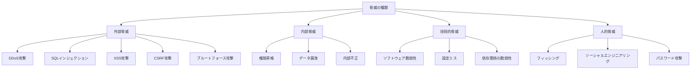

# 07. セキュリティ要件

## 🔒 セキュリティ概要

### セキュリティ目標
1. **機密性（Confidentiality）**: ユーザーデータと知的財産の保護
2. **完全性（Integrity）**: データの改ざん・破損防止
3. **可用性（Availability）**: サービスの継続的な提供
4. **認証（Authentication）**: 正当なユーザーの識別
5. **認可（Authorization）**: 適切なアクセス権限の管理
6. **追跡可能性（Auditability）**: セキュリティイベントの記録と分析

### 脅威モデル


---

## 🔐 認証・認可

### 1. 認証システム

#### 1.1 多要素認証（MFA）
```typescript
interface MFAConfiguration {
  // 認証方式
  methods: {
    totp: boolean // Time-based One-Time Password (Google Authenticator等)
    sms: boolean // SMS認証
    email: boolean // メール認証
    backup_codes: boolean // バックアップコード
    webauthn: boolean // WebAuthn (FIDO2)
  }
  
  // 設定
  enforce_for_admin: boolean
  enforce_for_high_value_actions: boolean
  backup_codes_count: number
  totp_window: number // 許容時間窓（秒）
}

// TOTP設定
interface TOTPSetup {
  secret: string
  qr_code_url: string
  backup_codes: string[]
  recovery_codes: string[]
}

// WebAuthn設定
interface WebAuthnCredential {
  id: string
  public_key: string
  counter: number
  device_name?: string
  created_at: string
  last_used_at?: string
}
```

#### 1.2 OAuth2.0 / OpenID Connect
```typescript
interface OAuthProvider {
  provider_id: string
  provider_name: string
  client_id: string
  client_secret: string // 暗号化保存
  scopes: string[]
  authorize_url: string
  token_url: string
  userinfo_url: string
  
  // セキュリティ設定
  pkce_required: boolean // Proof Key for Code Exchange
  state_validation: boolean
  nonce_validation: boolean
  jwt_signature_validation: boolean
}

// サポートプロバイダー
const OAUTH_PROVIDERS = {
  google: {
    scopes: ['openid', 'email', 'profile'],
    pkce_required: true,
    jwt_signature_validation: true
  },
  github: {
    scopes: ['user:email'],
    pkce_required: true
  },
  microsoft: {
    scopes: ['openid', 'email', 'profile'],
    pkce_required: true,
    jwt_signature_validation: true
  }
}
```

#### 1.3 セッション管理
```typescript
interface SessionSecurity {
  // セッション設定
  session_timeout: number // 24時間（秒）
  idle_timeout: number // 2時間（秒）
  max_concurrent_sessions: number // 同時セッション数制限
  
  // セキュリティ設定
  secure_flag: boolean // HTTPS必須
  same_site: 'strict' | 'lax' | 'none'
  http_only: boolean // XSS対策
  
  // セッション検証
  ip_validation: boolean // IP変更検知
  user_agent_validation: boolean // User-Agent変更検知
  geographic_validation: boolean // 地理的位置変更検知
}

interface SessionData {
  session_id: string
  user_id: string
  created_at: string
  last_accessed_at: string
  ip_address: string
  user_agent: string
  device_fingerprint?: string
  location?: {
    country: string
    region: string
    city: string
  }
  is_mobile: boolean
  security_level: 'low' | 'medium' | 'high'
}
```

### 2. 認可システム

#### 2.1 役割ベースアクセス制御（RBAC）
```typescript
interface Role {
  id: string
  name: string
  description: string
  permissions: Permission[]
  is_system_role: boolean
  created_at: string
}

interface Permission {
  id: string
  resource: string // prompt, template, team, user, admin
  action: string // create, read, update, delete, execute, share
  conditions?: PermissionCondition[]
}

interface PermissionCondition {
  field: string // user_id, team_id, visibility等
  operator: 'eq' | 'ne' | 'in' | 'not_in'
  value: any
}

// システム定義役割
const SYSTEM_ROLES = {
  SUPER_ADMIN: {
    permissions: ['*:*'] // 全権限
  },
  ADMIN: {
    permissions: [
      'user:read', 'user:update', 'user:delete',
      'prompt:*', 'template:*', 'team:*'
    ]
  },
  TEAM_ADMIN: {
    permissions: [
      'team:read', 'team:update', 'team:invite',
      'prompt:read', 'prompt:update', 'prompt:delete'
    ],
    conditions: [
      { field: 'team_id', operator: 'in', value: 'user.team_ids' }
    ]
  },
  USER: {
    permissions: [
      'prompt:create', 'prompt:read', 'prompt:update', 'prompt:delete',
      'template:create', 'template:read', 'template:update', 'template:delete'
    ],
    conditions: [
      { field: 'user_id', operator: 'eq', value: 'current_user.id' }
    ]
  }
}
```

#### 2.2 属性ベースアクセス制御（ABAC）
```typescript
interface AccessPolicy {
  id: string
  name: string
  description: string
  
  // ポリシールール
  subject: PolicyCondition // ユーザー属性
  resource: PolicyCondition // リソース属性
  action: string[]
  environment?: PolicyCondition // 環境条件
  
  effect: 'allow' | 'deny'
  priority: number
}

interface PolicyCondition {
  [key: string]: {
    operator: 'eq' | 'ne' | 'gt' | 'lt' | 'in' | 'contains' | 'regex'
    value: any
  }
}

// ポリシー例
const ACCESS_POLICIES = [
  {
    name: "Team Member Access",
    subject: { 
      'user.team_ids': { operator: 'contains', value: 'resource.team_id' }
    },
    resource: { 
      'resource.visibility': { operator: 'eq', value: 'team' }
    },
    action: ['read', 'comment'],
    effect: 'allow'
  },
  {
    name: "High Security Content",
    subject: { 
      'user.security_clearance': { operator: 'gte', value: 'high' }
    },
    resource: { 
      'resource.security_level': { operator: 'eq', value: 'confidential' }
    },
    environment: {
      'request.ip': { operator: 'in', value: 'allowed_ip_ranges' },
      'request.time': { operator: 'between', value: ['09:00', '18:00'] }
    },
    effect: 'allow'
  }
]
```

---

## 🛡️ アプリケーションセキュリティ

### 1. 入力検証・サニタイゼーション

#### 1.1 入力検証戦略
```typescript
interface ValidationStrategy {
  // ホワイトリスト方式
  whitelist_validation: boolean
  
  // 検証ルール
  string_validation: {
    max_length: Record<string, number>
    allowed_characters: Record<string, RegExp>
    encoding_validation: boolean
  }
  
  // SQLインジェクション対策
  sql_injection_prevention: {
    parameterized_queries: boolean
    orm_usage: boolean
    input_escaping: boolean
  }
  
  // XSS対策
  xss_prevention: {
    html_sanitization: boolean
    content_security_policy: boolean
    output_encoding: boolean
  }
}

// バリデーションライブラリ設定
import { z } from 'zod'

const PromptContentSchema = z.string()
  .min(1, "プロンプト内容は必須です")
  .max(10000, "プロンプト内容は10,000文字以内です")
  .regex(/^[\s\S]*$/, "不正な文字が含まれています")
  .transform(content => {
    // HTMLエスケープ
    return content
      .replace(/&/g, '&amp;')
      .replace(/</g, '&lt;')
      .replace(/>/g, '&gt;')
      .replace(/"/g, '&quot;')
      .replace(/'/g, '&#x27;')
  })
```

#### 1.2 ファイルアップロードセキュリティ
```typescript
interface FileUploadSecurity {
  // ファイル制限
  max_file_size: number // 10MB
  allowed_extensions: string[] // ['.jpg', '.png', '.pdf', '.txt']
  allowed_mime_types: string[]
  
  // セキュリティチェック
  virus_scanning: boolean
  content_type_validation: boolean
  file_signature_validation: boolean // マジックナンバーチェック
  
  // 保存設定
  random_filename: boolean
  separate_storage_domain: boolean
  execution_prevention: boolean
}

interface FileValidation {
  validateFileType(file: File): boolean
  validateFileSize(file: File): boolean
  validateFileContent(file: File): Promise<boolean>
  scanForMalware(file: File): Promise<boolean>
  generateSecureFilename(originalName: string): string
}
```

### 2. API セキュリティ

#### 2.1 レート制限・DDoS対策
```typescript
interface RateLimitingStrategy {
  // レート制限レベル
  global_rate_limit: {
    requests_per_second: number
    burst_capacity: number
  }
  
  user_rate_limit: {
    requests_per_minute: number
    requests_per_hour: number
    requests_per_day: number
  }
  
  endpoint_specific_limits: Record<string, {
    requests_per_minute: number
    requests_per_hour: number
  }>
  
  // DDoS対策
  ddos_protection: {
    enable_cloudflare: boolean
    ip_reputation_check: boolean
    geographic_blocking: boolean
    challenge_solving: boolean
  }
}

// Redis設定例（レート制限）
interface RateLimitRedisConfig {
  sliding_window: {
    window_size: number // 60秒
    max_requests: number
    key_prefix: string
  }
  
  fixed_window: {
    window_size: number // 3600秒
    max_requests: number
    key_prefix: string
  }
}
```

#### 2.2 API脅威対策
```typescript
interface APISecurityMeasures {
  // OWASP API Top 10対策
  broken_object_level_authorization: {
    resource_id_validation: boolean
    owner_verification: boolean
  }
  
  broken_user_authentication: {
    jwt_validation: boolean
    token_expiration: boolean
    refresh_token_rotation: boolean
  }
  
  excessive_data_exposure: {
    response_filtering: boolean
    field_level_permissions: boolean
  }
  
  lack_of_resources_rate_limiting: {
    rate_limiting: boolean
    query_complexity_analysis: boolean
  }
  
  broken_function_level_authorization: {
    endpoint_permissions: boolean
    method_validation: boolean
  }
  
  mass_assignment: {
    input_whitelisting: boolean
    schema_validation: boolean
  }
  
  security_misconfiguration: {
    secure_headers: boolean
    cors_configuration: boolean
    error_handling: boolean
  }
  
  injection: {
    sql_injection_prevention: boolean
    nosql_injection_prevention: boolean
    command_injection_prevention: boolean
  }
  
  improper_assets_management: {
    api_versioning: boolean
    endpoint_inventory: boolean
    deprecated_endpoint_handling: boolean
  }
  
  insufficient_logging_monitoring: {
    security_event_logging: boolean
    real_time_monitoring: boolean
    alerting: boolean
  }
}
```

---

## 🔍 データ保護・プライバシー

### 1. データ分類・保護

#### 1.1 データ分類システム
```typescript
enum DataClassification {
  PUBLIC = 'public',           // 公開情報
  INTERNAL = 'internal',       // 内部情報
  CONFIDENTIAL = 'confidential', // 機密情報
  RESTRICTED = 'restricted'    // 極秘情報
}

interface DataProtectionPolicy {
  classification: DataClassification
  
  // 暗号化要件
  encryption_at_rest: boolean
  encryption_in_transit: boolean
  encryption_algorithm: 'AES-256' | 'ChaCha20-Poly1305'
  
  // アクセス制御
  access_logging: boolean
  approval_required: boolean
  mfa_required: boolean
  
  // 保持・削除
  retention_period_days: number
  auto_deletion: boolean
  secure_deletion: boolean
  
  // 地理的制限
  geographic_restrictions: string[]
  cross_border_transfer_allowed: boolean
}

// データ分類例
const DATA_CLASSIFICATIONS = {
  user_prompts: {
    classification: DataClassification.CONFIDENTIAL,
    encryption_at_rest: true,
    retention_period_days: 2555, // 7年
    geographic_restrictions: ['EU', 'US', 'JP']
  },
  
  ai_api_keys: {
    classification: DataClassification.RESTRICTED,
    encryption_at_rest: true,
    encryption_in_transit: true,
    mfa_required: true,
    approval_required: true
  },
  
  public_prompts: {
    classification: DataClassification.PUBLIC,
    encryption_at_rest: false,
    retention_period_days: -1 // 無期限
  }
}
```

#### 1.2 暗号化実装

```typescript
interface EncryptionService {
  // 対称暗号化（データ保存用）
  encryptData(data: string, keyId: string): Promise<EncryptedData>
  decryptData(encryptedData: EncryptedData, keyId: string): Promise<string>
  
  // 非対称暗号化（キー交換用）
  generateKeyPair(): Promise<KeyPair>
  encryptWithPublicKey(data: string, publicKey: string): Promise<string>
  decryptWithPrivateKey(encryptedData: string, privateKey: string): Promise<string>
  
  // ハッシュ化（パスワード用）
  hashPassword(password: string): Promise<string>
  verifyPassword(password: string, hash: string): Promise<boolean>
  
  // デジタル署名
  signData(data: string, privateKey: string): Promise<string>
  verifySignature(data: string, signature: string, publicKey: string): Promise<boolean>
}

interface EncryptedData {
  encrypted_content: string
  encryption_algorithm: string
  key_id: string
  initialization_vector: string
  authentication_tag: string
  created_at: string
}

// Key Management Service設定
interface KMSConfiguration {
  provider: 'aws-kms' | 'google-kms' | 'azure-kv' | 'hashicorp-vault'
  
  key_rotation: {
    automatic_rotation: boolean
    rotation_interval_days: number
  }
  
  access_control: {
    key_usage_logging: boolean
    approval_required_for_access: boolean
    geographic_restrictions: string[]
  }
  
  backup: {
    backup_enabled: boolean
    backup_frequency_hours: number
    cross_region_backup: boolean
  }
}
```

### 2. プライバシー保護

#### 2.1 GDPR準拠
```typescript
interface GDPRCompliance {
  // データ主体の権利
  right_of_access: {
    data_export_api: string
    response_time_days: number // 30日以内
  }
  
  right_to_rectification: {
    data_correction_api: string
    verification_required: boolean
  }
  
  right_to_erasure: {
    data_deletion_api: string
    hard_delete: boolean
    anonymization_option: boolean
  }
  
  right_to_data_portability: {
    data_export_formats: ['json', 'csv', 'xml']
    structured_format: boolean
  }
  
  right_to_object: {
    opt_out_api: string
    granular_consent: boolean
  }
  
  // 同意管理
  consent_management: {
    explicit_consent_required: boolean
    granular_consent: boolean
    consent_withdrawal: boolean
    consent_history_tracking: boolean
  }
  
  // データ保護責任者
  data_protection_officer: {
    contact_email: string
    contact_form_url: string
  }
}
```

#### 2.2 プライバシー設定
```typescript
interface PrivacySettings {
  // データ収集
  analytics_consent: boolean
  marketing_consent: boolean
  functional_cookies_consent: boolean
  
  // プロフィール公開設定
  profile_visibility: 'public' | 'registered_users' | 'private'
  email_visibility: boolean
  activity_visibility: boolean
  
  // 通知設定
  email_notifications: boolean
  push_notifications: boolean
  marketing_emails: boolean
  
  // データ共有
  allow_prompt_analytics: boolean
  allow_usage_statistics: boolean
  allow_improvement_feedback: boolean
  
  // 第三者との共有
  third_party_integrations: boolean
  ai_model_training_consent: boolean
}

interface DataProcessingRecord {
  purpose: string
  legal_basis: 'consent' | 'contract' | 'legal_obligation' | 'vital_interests' | 'public_task' | 'legitimate_interests'
  data_categories: string[]
  retention_period: string
  recipients: string[]
  cross_border_transfers: boolean
  automated_decision_making: boolean
}
```

### 3. データ匿名化・仮名化

#### 3.1 匿名化技術
```typescript
interface AnonymizationService {
  // k-匿名性
  k_anonymize(data: any[], k: number, quasi_identifiers: string[]): any[]
  
  // l-多様性
  l_diversity(data: any[], l: number, sensitive_attributes: string[]): any[]
  
  // 差分プライバシー
  differential_privacy(data: any[], epsilon: number, query: string): any
  
  // データマスキング
  mask_data(data: string, mask_type: 'partial' | 'full' | 'hash'): string
  
  // 仮名化
  pseudonymize(data: string, salt: string): string
  de_pseudonymize(pseudonymized_data: string, salt: string): string
}

// 匿名化ルール設定
interface AnonymizationRules {
  user_data: {
    email: 'hash' // example@domain.com -> hash_value
    name: 'partial_mask' // John Doe -> J*** D**
    ip_address: 'subnet_mask' // 192.168.1.1 -> 192.168.1.0
  }
  
  prompt_data: {
    personal_references: 'entity_replacement' // 固有名詞を一般名詞に
    sensitive_content: 'redaction' // センシティブ内容を削除
    timestamps: 'generalization' // 具体的日時を期間に
  }
  
  analytics_data: {
    user_id: 'pseudonymization'
    session_id: 'hash'
    usage_patterns: 'aggregation'
  }
}
```

---

## 🔐 インフラセキュリティ

### 1. ネットワークセキュリティ

#### 1.1 ネットワーク分離
```yaml
# VPC設定例
network_architecture:
  vpc:
    cidr: "10.0.0.0/16"
    
  subnets:
    public:
      web_tier:
        cidr: "10.0.1.0/24"
        resources: ["Load Balancer", "NAT Gateway"]
      
    private:
      app_tier:
        cidr: "10.0.2.0/24"
        resources: ["Web Servers", "API Servers"]
      
      data_tier:
        cidr: "10.0.3.0/24"
        resources: ["Database", "Cache", "File Storage"]
    
    isolated:
      admin_tier:
        cidr: "10.0.4.0/24"
        resources: ["Admin Panel", "Monitoring"]

  security_groups:
    web_sg:
      inbound:
        - port: 443, source: "0.0.0.0/0"
        - port: 80, source: "0.0.0.0/0"
      outbound:
        - port: 3000, destination: "app_tier"
    
    app_sg:
      inbound:
        - port: 3000, source: "web_sg"
      outbound:
        - port: 5432, destination: "db_sg"
        - port: 6379, destination: "cache_sg"
    
    db_sg:
      inbound:
        - port: 5432, source: "app_sg"
      outbound: []
```

#### 1.2 WAF（Web Application Firewall）
```typescript
interface WAFConfiguration {
  // OWASP Core Rule Set
  core_rules: {
    sql_injection: boolean
    xss_protection: boolean
    remote_file_inclusion: boolean
    local_file_inclusion: boolean
    remote_code_execution: boolean
  }
  
  // カスタムルール
  custom_rules: Array<{
    name: string
    description: string
    rule_type: 'block' | 'allow' | 'monitor'
    conditions: Array<{
      field: 'uri' | 'header' | 'body' | 'query_string'
      operator: 'contains' | 'equals' | 'regex' | 'length'
      value: string
    }>
    action: 'block' | 'challenge' | 'allow' | 'log'
  }>
  
  // レート制限
  rate_limiting: {
    requests_per_minute: number
    burst_capacity: number
    block_duration_minutes: number
  }
  
  // IP制限
  ip_access_control: {
    whitelist: string[]
    blacklist: string[]
    geo_blocking: string[] // 国コード
  }
}
```

### 2. コンテナセキュリティ

#### 2.1 Docker設定
```dockerfile
# セキュアなDockerfile例
FROM node:20-alpine AS base

# セキュリティアップデート
RUN apk update && apk upgrade && apk add --no-cache dumb-init

# 非rootユーザー作成
RUN addgroup -g 1001 -S nodejs
RUN adduser -S nextjs -u 1001

# 作業ディレクトリ設定
WORKDIR /app

# 依存関係のコピーとインストール
COPY package*.json ./
RUN npm ci --only=production && npm cache clean --force

# アプリケーションコード
COPY --chown=nextjs:nodejs . .

# ヘルスチェック
HEALTHCHECK --interval=30s --timeout=3s --start-period=5s --retries=3 \
  CMD curl -f http://localhost:3000/api/health || exit 1

# 非rootユーザーで実行
USER nextjs

# セキュリティオプション
EXPOSE 3000
ENTRYPOINT ["dumb-init", "--"]
CMD ["npm", "start"]
```

#### 2.2 Kubernetes セキュリティ
```yaml
# セキュアなKubernetes設定
apiVersion: apps/v1
kind: Deployment
metadata:
  name: prompthub-app
spec:
  template:
    spec:
      securityContext:
        runAsNonRoot: true
        runAsUser: 1001
        fsGroup: 1001
      
      containers:
      - name: app
        image: prompthub/app:latest
        securityContext:
          allowPrivilegeEscalation: false
          capabilities:
            drop:
            - ALL
          readOnlyRootFilesystem: true
          runAsNonRoot: true
          seccompProfile:
            type: RuntimeDefault
        
        resources:
          limits:
            cpu: 500m
            memory: 512Mi
          requests:
            cpu: 200m
            memory: 256Mi
        
        livenessProbe:
          httpGet:
            path: /api/health
            port: 3000
          initialDelaySeconds: 30
          periodSeconds: 10
        
        readinessProbe:
          httpGet:
            path: /api/ready
            port: 3000
          initialDelaySeconds: 5
          periodSeconds: 5

---
apiVersion: v1
kind: NetworkPolicy
metadata:
  name: prompthub-network-policy
spec:
  podSelector:
    matchLabels:
      app: prompthub
  policyTypes:
  - Ingress
  - Egress
  ingress:
  - from:
    - podSelector:
        matchLabels:
          app: nginx-ingress
    ports:
    - protocol: TCP
      port: 3000
  egress:
  - to:
    - podSelector:
        matchLabels:
          app: postgres
    ports:
    - protocol: TCP
      port: 5432
```

---

## 📊 セキュリティ監視・インシデント対応

### 1. セキュリティ監視

#### 1.1 SIEM（Security Information and Event Management）
```typescript
interface SecurityEvent {
  id: string
  timestamp: string
  event_type: SecurityEventType
  severity: 'low' | 'medium' | 'high' | 'critical'
  source: string
  
  // イベント詳細
  user_id?: string
  ip_address: string
  user_agent?: string
  endpoint?: string
  request_id?: string
  
  // 検知内容
  threat_indicators: string[]
  risk_score: number // 0-100
  false_positive_probability: number
  
  // レスポンス
  automated_response: string[]
  manual_investigation_required: boolean
  status: 'new' | 'investigating' | 'resolved' | 'false_positive'
}

enum SecurityEventType {
  // 認証関連
  FAILED_LOGIN = 'failed_login',
  BRUTE_FORCE_ATTEMPT = 'brute_force_attempt',
  SUSPICIOUS_LOGIN = 'suspicious_login',
  PRIVILEGE_ESCALATION = 'privilege_escalation',
  
  // API関連
  RATE_LIMIT_EXCEEDED = 'rate_limit_exceeded',
  SUSPICIOUS_API_USAGE = 'suspicious_api_usage',
  UNAUTHORIZED_ACCESS_ATTEMPT = 'unauthorized_access_attempt',
  
  // データ関連
  DATA_EXFILTRATION_ATTEMPT = 'data_exfiltration_attempt',
  SENSITIVE_DATA_ACCESS = 'sensitive_data_access',
  BULK_DATA_DOWNLOAD = 'bulk_data_download',
  
  // アプリケーション関連
  SQL_INJECTION_ATTEMPT = 'sql_injection_attempt',
  XSS_ATTEMPT = 'xss_attempt',
  FILE_UPLOAD_THREAT = 'file_upload_threat',
  
  // インフラ関連
  UNUSUAL_NETWORK_TRAFFIC = 'unusual_network_traffic',
  MALWARE_DETECTED = 'malware_detected',
  CONFIGURATION_CHANGE = 'configuration_change'
}
```

#### 1.2 リアルタイム監視
```typescript
interface SecurityMonitoring {
  // 異常検知ルール
  anomaly_detection: {
    // ユーザー行動分析
    user_behavior_analysis: {
      login_pattern_analysis: boolean
      api_usage_pattern_analysis: boolean
      geographic_anomaly_detection: boolean
      time_based_anomaly_detection: boolean
    }
    
    // ネットワーク監視
    network_monitoring: {
      ddos_detection: boolean
      port_scan_detection: boolean
      suspicious_traffic_analysis: boolean
    }
    
    // アプリケーション監視
    application_monitoring: {
      error_rate_monitoring: boolean
      response_time_monitoring: boolean
      database_query_monitoring: boolean
    }
  }
  
  // アラート設定
  alerting: {
    real_time_alerts: Array<{
      condition: string
      severity: string
      notification_channels: string[]
      escalation_policy: string
    }>
    
    notification_channels: {
      email: string[]
      slack: string
      pagerduty: string
      webhook: string
    }
  }
}
```

### 2. インシデント対応

#### 2.1 インシデント対応プロセス
```typescript
interface IncidentResponse {
  // 対応フェーズ
  phases: {
    preparation: IncidentPreparation
    identification: IncidentIdentification
    containment: IncidentContainment
    eradication: IncidentEradication
    recovery: IncidentRecovery
    lessons_learned: LessonsLearned
  }
  
  // 対応チーム
  response_team: {
    incident_commander: string
    security_analyst: string[]
    system_admin: string[]
    development_team: string[]
    legal_counsel: string
    communications: string
  }
  
  // エスカレーションマトリックス
  escalation_matrix: Array<{
    severity: 'low' | 'medium' | 'high' | 'critical'
    response_time_minutes: number
    notification_list: string[]
    required_approvals: string[]
  }>
}

interface IncidentContainment {
  // 自動対応
  automated_responses: {
    block_ip_address: boolean
    disable_user_account: boolean
    rate_limit_enforcement: boolean
    traffic_redirection: boolean
  }
  
  // 手動対応
  manual_procedures: {
    isolate_affected_systems: string[]
    preserve_evidence: boolean
    communicate_with_stakeholders: boolean
    implement_workarounds: boolean
  }
}
```

#### 2.2 フォレンジック調査
```typescript
interface DigitalForensics {
  // 証拠保全
  evidence_preservation: {
    log_collection: {
      application_logs: boolean
      system_logs: boolean
      network_logs: boolean
      database_logs: boolean
    }
    
    memory_dumps: boolean
    disk_images: boolean
    network_captures: boolean
    
    chain_of_custody: {
      evidence_collection_time: string
      collected_by: string
      storage_location: string
      access_log: string[]
    }
  }
  
  // 分析ツール
  analysis_tools: {
    log_analysis: string[] // ELK Stack, Splunk等
    network_analysis: string[] // Wireshark, tcpdump等
    malware_analysis: string[] // VirusTotal, Cuckoo等
    memory_analysis: string[] // Volatility等
  }
  
  // レポート作成
  incident_report: {
    executive_summary: string
    timeline_of_events: string
    impact_assessment: string
    root_cause_analysis: string
    recommendations: string[]
    lessons_learned: string[]
  }
}
```

---

## 🧪 セキュリティテスト

### 1. 脆弱性テスト

#### 1.1 ペネトレーションテスト
```typescript
interface PenetrationTesting {
  // テストスコープ
  scope: {
    web_application: boolean
    api_endpoints: boolean
    mobile_application: boolean
    infrastructure: boolean
    social_engineering: boolean
  }
  
  // テスト手法
  methodologies: {
    owasp_testing_guide: boolean
    nist_sp_800_115: boolean
    ptes_standard: boolean
    osstmm: boolean
  }
  
  // 自動ツール
  automated_tools: {
    web_scanners: ['OWASP ZAP', 'Burp Suite', 'Nessus']
    network_scanners: ['Nmap', 'Masscan', 'Zmap']
    static_analysis: ['SonarQube', 'Veracode', 'Checkmarx']
    dynamic_analysis: ['OWASP ZAP', 'AppScan', 'WebInspect']
  }
  
  // 手動テスト
  manual_testing: {
    business_logic_flaws: boolean
    authentication_bypass: boolean
    authorization_flaws: boolean
    input_validation_issues: boolean
    session_management_flaws: boolean
  }
}
```

#### 1.2 コードレビュー
```typescript
interface SecurityCodeReview {
  // 自動化スキャン
  static_analysis: {
    tools: ['ESLint Security', 'Semgrep', 'CodeQL']
    rules: {
      sql_injection: boolean
      xss_vulnerabilities: boolean
      insecure_cryptography: boolean
      hardcoded_secrets: boolean
      insecure_dependencies: boolean
    }
  }
  
  // 手動レビュー
  manual_review: {
    authentication_logic: boolean
    authorization_logic: boolean
    input_validation: boolean
    output_encoding: boolean
    error_handling: boolean
    logging_implementation: boolean
  }
  
  // セキュアコーディング基準
  secure_coding_standards: {
    owasp_secure_coding_practices: boolean
    language_specific_guidelines: boolean
    company_coding_standards: boolean
  }
}
```

### 2. セキュリティ自動化

#### 2.1 CI/CDパイプラインセキュリティ
```yaml
# GitHub Actions セキュリティチェック例
name: Security Checks

on: [push, pull_request]

jobs:
  security-scan:
    runs-on: ubuntu-latest
    steps:
      - uses: actions/checkout@v3
      
      # 依存関係脆弱性チェック
      - name: Run npm audit
        run: npm audit --audit-level=moderate
      
      # シークレットスキャン
      - name: Secret Scanning
        uses: trufflesecurity/trufflehog@main
        with:
          path: ./
          base: main
          head: HEAD
      
      # 静的解析
      - name: Static Analysis
        uses: github/super-linter@v4
        env:
          DEFAULT_BRANCH: main
          GITHUB_TOKEN: ${{ secrets.GITHUB_TOKEN }}
          VALIDATE_TYPESCRIPT_ES: true
          VALIDATE_JAVASCRIPT_ES: true
      
      # Docker イメージスキャン
      - name: Container Scan
        uses: azure/container-scan@v0
        with:
          image-name: ${{ env.IMAGE_NAME }}
      
      # Infrastructure as Code セキュリティ
      - name: Terraform Security Scan
        uses: aquasecurity/tfsec-action@v1.0.0
```

#### 2.2 継続的セキュリティ監視
```typescript
interface ContinuousSecurityMonitoring {
  // 依存関係監視
  dependency_monitoring: {
    vulnerability_databases: ['NVD', 'GitHub Advisory', 'Snyk']
    automated_updates: boolean
    security_patch_notifications: boolean
    license_compliance_check: boolean
  }
  
  // インフラ監視
  infrastructure_monitoring: {
    configuration_drift_detection: boolean
    compliance_monitoring: boolean // SOC2, ISO27001等
    cloud_security_posture: boolean
    container_runtime_protection: boolean
  }
  
  // アプリケーション監視
  application_monitoring: {
    runtime_application_self_protection: boolean
    api_security_monitoring: boolean
    data_loss_prevention: boolean
    insider_threat_detection: boolean
  }
}
```
